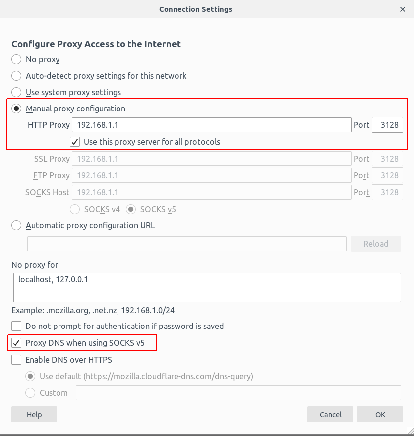
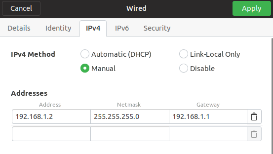

\newpage

\tableofcontents

\newpage

# Introduction

Le but de ce projet est de configuré une borne d'accès Internet afin que tous les clients passent par une connexion anonymisée, par exemple avec TOR ou un VPN. Ce genre de borne d'accès permettrait, par exemple à un journaliste d'avoir un accès à Internet sûr dans un pays où les lois ne sont pas adaptés.

Pour ce projet nous avons choisi de faire une borne d'accès TOR pour découvrir cette technologie.

# Prérequis

Pour réaliser ce projet, nous avons utilisé 2 machines virtuelles linux, une client et une serveur.  La machine access point doit avoir 2 carte réseau, une connecté à internet et une autre pour le réseau locale

## Machines Virtuelle

- Access Point : Machine GNU/Linux, Ubuntu 18.10
- Client : Machine GNU/nLinux, Ubuntu 18.10

## Réseau

Le structure du réseau est celle-ci : 

{ width=50% }

## Machine Virtuelle Access Point

La machine virtuelle faisant office d'Access Point requiert plus de configuration que la machine client. Les paquets requis sont listés ci-dessous

### Programmes nécessaires

Pour l'access point nous avons besoin d'installer Tor [@SetupTor] et Privoxy [@Schaefer]

- privoxy
- tor

```sh
apt-get update
apt-get upgrade
apt-get install net-tools tor privoxy -y
```

### Cartes réseau

Voici la configuration nécessaire pour les 2 cartes réseaux dans VirtualBox.

#### Carte connectée à Internet

**Mode :** NAT
**IP :** Automatique


#### Carte connectée au réseau local

**Mode :** Internal Network
**IP :** 192.168.1.1


## Machine Virtuelle Client

Cette section présente les programmes pour la configuration du client et la configuration réseau VirtualBox pour le bon fonctionnement de la machine virtuelle.

### Programmes nécessaires

Le client ne nécessite pas d'installation nécessaire, nous avons uniquement besoin d'un navigateur. Firefox étant installé par défaut, il ne faut rien installer

### Cartes réseau

Voici la configuration dans VirtualBox de la carte réseau du client.

**Mode :** NAT
**IP :** 192.168.1.2

# Réalisation

La majeur partie du travail a été de configuré l'access point et que tous les services démarrent au démarrage de la machine

## Access Point

La première étape de ce travail a été de configurer la carte réseau de l'access point, privoxy et TOR pour que les services démarrent et que l'utilisateur n'ait pas à devoir savoir configurer l'access point.

### Script de configuration

```shell
sudo su
apt-get update
apt-get upgrade
apt-get install tor privoxy -y
echo "SocksPort 9050
SocksListenAddress 127.0.0.1
Log info file /var/log/tor/notices.log" > /etc/tor/torrc

echo "user-manual /usr/share/doc/privoxy/user-manual
confdir /etc/privoxy
logdir /var/log/privoxy
actionsfile match-all.action 
actionsfile default.action 
actionsfile user.action 
filterfile default.filter
filterfile user.filter
debug   1
logfile logfile
listen-address  127.0.0.1:3128
listen-address  [::1]:3128
listen-address  192.168.1.1:3128
toggle  1
enable-remote-toggle  0
enable-remote-http-toggle  0
enable-edit-actions 0
enforce-blocks 0
buffer-limit 4096
enable-proxy-authentication-forwarding 0
forwarded-connect-retries  0
accept-intercepted-requests 0
allow-cgi-request-crunching 0
split-large-forms 0
keep-alive-timeout 5
tolerate-pipelining 1
socket-timeout 300
forward-socks5 / localhost:9050 .
" > /etc/privoxy/config

systemctl enable tor privoxy
systemctl restart tor privoxy
exit
```

Pour la configuration nous avons pris la configuration qui nous a été transmis par mail, [@Schaefer]. Ensuite nous avons fait un `diff` pour voir quelles lignes étaient différentes pour intégrer à notre config par défaut.

### Configuration réseau

Nous devons changer la configuration de la carte réseau pour avoir une carte d'entrée et une carte de sortie. La con

## Client

Pour le client, la seule configuration à faire se trouver dans le navigateur et les paramètres.

La configuration de la carte réseau permet de paramètrer l'access point comme gateway.

Nous avons changé le proxy du navigateur et également désactivé le Javascript pour évité le tracking non-désiré de certains sites.

### Configuration réseau du navigateur.

Pour configurer le navigateur il faut modifier les paramètres de connexion afin qu'elle soit identique à ceci :

{ width=60% }

Et pour désactivé le navigateur il faut taper `about:config` dans la barre d'adresse et changé la valeur à false comme sur l'image ci-dessous

{ width=80% }

Nous avons vérifié que le javascript ait bien été désactivé en allant sur facebook, on peut voir le paramètre "noscript" s'afficher dans la barre d'adresse du navigateur.

{ width=80% }

### Configuration de la carte réseau

Il faut configurer la carte réseau pour que la gateway soit l'access point

{ width=60% }

# Conclusion

Pour conclure, le projet c'est déroulé sans gros problème, certaines configurationes n'étaient pas évidentes, mais avec l'aide de M. Schaefer et quelques recherches sur Internet, les problèmes ont été résolus. Finalement, la machine virtuelle fonctionne et les services se lancent au démarrage sans que l'utilisateur n'ait à se connecter à l'Access Point. Par contre il devra quand même changer ses paramètres réseaux et la configuration du navigateur.

\newpage

\listoffigures

# References

