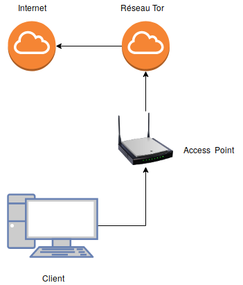

\newpage

\tableofcontents

\newpage

# Introduction

Le but de ce projet est de configuré une borne d'accès Internet afin que tous les clients passent par une connexion anonymisée, par exemple avec TOR ou un VPN. Ce genre de borne d'accès permettrait, par exemple à un journaliste d'avoir un accès à Internet sûr dans un pays où les lois ne sont pas adaptés.

Pour ce projet nous avons choisi de faire une borne d'accès TOR pour découvrir cette technologie.

# Prérequis

Pour réaliser ce projet, nous avons utilisé 2 machines virtuelles linux, une client et une serveur.  La machine access point doit avoir 2 carte réseau, une connecté à internet et une autre pour le réseau locale

## Machines Virtuelle

- Access Point : Machine GNU/Linux, Ubuntu 18.10
- Client : Machine GNU/nLinux, Ubuntu 18.10

## Réseau

Le structure du réseau est celle-ci : 

{ width=50% }

## Machine Virtuelle Access Point

La machine virtuelle faisant office d'Access Point requiert plus de configuration que la machine client. Les paquets requi

### Programmes nécessaires

Pour l'access point nous avons besoin d'installer Tor [@SetupTor] et Privoxy [@Schaefer]

- privoxy
- tor

```sh
apt-get update
apt-get upgrade
apt-get install net-tools tor privoxy -y
```

### Cartes réseau

Voici la configuration nécessaire pour les 2 cartes réseaux dans VirtualBox.

#### Carte connectée à Internet

**Mode :** NAT

#### Carte connectée au réseau local

**Mode :** Internal Network

## Machine Virtuelle Client

Cette section présente les programmes pour la configuration du client et la configuration réseau VirtualBox pour le bon fonctionnement de la machine virtuelle.

### Programmes nécessaires

Le client ne nécessite pas d'installation nécessaire, nous avons uniquement besoin d'un navigateur. Firefox étant installé par défaut, il ne faut rien installer

### Cartes réseau

Voici la configuration dans VirtualBox de la carte réseau du client.

**Mode :** NAT

# Réalisation

La majeur partie du travail a été de configuré l'access point pour que tous les services démarrent au démarrage de la machine

## Access Point

La première étape de ce travail a été de configurer la carte réseau de l'access point, privoxy et TOR pour que les services démarrent et que l'utilisateur n'ait pas à devoir savoir configurer l'access point.

### Configuration Réseau

### Configuration Privoxy

### Configuration TOR

## Client

Pour le client, la seule configuration à faire se trouver dans le navigateur.


bonjour[@Schaefer]

# Conclusion

bonjour

\newpage

\listoffigures

# References
